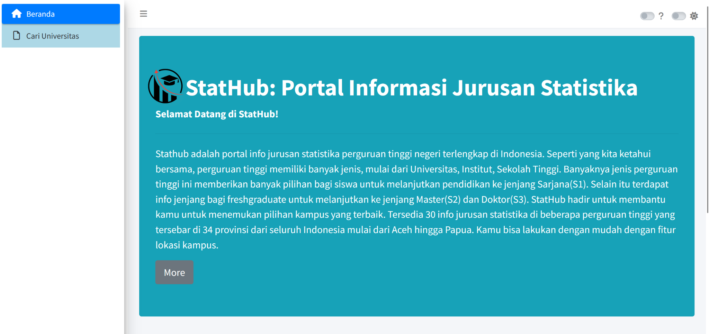
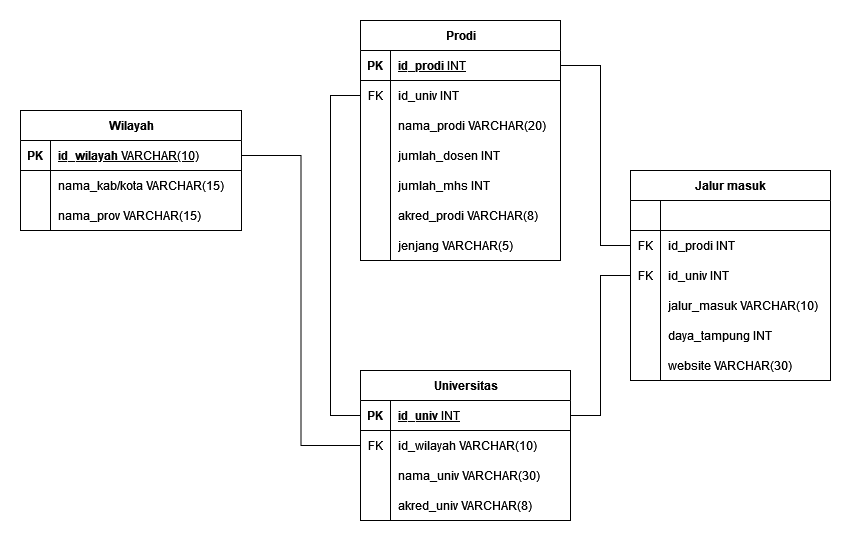

  

Ingin mempelajari ilmu yang sangat relevan di era data ini? Jurusan Statistika adalah pilihan tepat bagi kamu! Kamu akan belajar bagaimana mengumpulkan, mengorganisir, menganalisis, dan menafsirkan data. Bagi mereka yang tertarik dengan matematika, sains, dan pemecahan masalah, jurusan ini akan memberikan bekal yang sangat berharga.

**Apa Itu Statistika?**
Statistika adalah studi tentang pengumpulan, analisis, interpretasi, dan presentasi data. Di era di mana data adalah kunci untuk membuat keputusan bisnis, penelitian ilmiah, dan kebijakan publik, kemampuan untuk memahami dan mengelola data sangat penting. Statistik menawarkan alat dan teknik yang kuat untuk mengatasi kompleksitas dalam data, memberikan kemampuan untuk mengambil keputusan yang berbasis bukti dan mendukungnya dengan argumen yang kuat.

**Apa Saja yang Dipelajari dalam Statistika?**

**Dasar Matematika**: Mulai dari aljabar linear hingga kalkulus, dasar matematika adalah fondasi dari pemahaman statistik yang kuat.

**Statistika Deskriptif**: Belajar untuk merangkum dan mengorganisir data agar bisa dimengerti oleh orang lain.

**Statistika Inferensial**: Mengambil kesimpulan berdasarkan sampel data untuk menggeneralisasikan atau menyimpulkan tentang populasi yang lebih besar.

**Analisis Regresi**: Menjelajahi hubungan antara variabel dengan menggunakan model matematika.

**Statistika Nonparametrik**: Alat yang kuat ketika kita tidak memiliki informasi tentang distribusi populasi.

**Probabilitas**: Merumuskan dan memahami peluang kejadian.

**Pemrograman Statistik**: Penggunaan alat statistik dan bahasa pemrograman statistik seperti R atau Python untuk mengelola dan menganalisis data.

**Pengujian Hipotesis**: Menyelidiki kebenaran klaim atau hipotesis tentang data.

**Kombinatorik**: Belajar menghitung jumlah cara yang berbeda untuk membangun suatu objek atau rangkaian kejadian.

**Teori Pengambilan Keputusan**: Belajar untuk memilih pilihan terbaik berdasarkan informasi yang tersedia.

**Analisis Variansi**: Menggunakan statistik untuk menentukan pengaruh variabel-variabel tertentu terhadap hasil.

**Metode Penelitian**: Belajar untuk mendesain, melaksanakan, dan menafsirkan hasil penelitian.

Kami yakin dengan kurikulum yang komprehensif dan kualitas pengajaran yang terkenal, jurusan Statistika akan memberikan landasan yang kokoh bagi karier di bidang data, penelitian, keuangan, perencanaan bisnis, pengembangan produk, kebijakan publik, dan banyak lagi. Tertarik? Segera mendaftar dan bergabunglah di jurusan Statistika!

## INFO
**Stathub** adalah portal info jurusan statistika perguruan tinggi negeri terlengkap di Indonesia. Seperti yang kita ketahui bersama, perguruan tinggi memiliki banyak jenis, mulai dari Universitas, Institut, Sekolah Tinggi. Banyaknya jenis perguruan tinggi ini memberikan banyak pilihan bagi siswa untuk melanjutkan pendidikan ke jenjang Sarjana(S1). Selain itu terdapat info jenjang bagi freshgraduate untuk melanjutkan ke jenjang Master(S2) dan Doktor(S3).

**StatHub** hadir untuk membantu kamu untuk menemukan pilihan kampus yang terbaik. Tersedia 30 info jurusan statistika di beberapa perguruan tinggi yang tersebar di 34 provinsi dari seluruh Indonesia mulai dari Aceh hingga Papua. Kamu bisa lakukan dengan mudah dengan fitur lokasi kampus.

## Dashboard Database

  

## Skema Database

  

## ERD

## Deskripsi Data
StatHub adalah sebuah portal database universitas-universitas negeri di Indonesia yang memiliki jurusan statistika. Dengan hal ini, data yang diambil yakni berdasarkan pddikti dan sumber web resmi masing-masing universitas. Data yang kami ambil meliputi Universitas, Wilayah Universitas, Data Prodi (Dosen, Mahasiswa), Jenjang Pendidikan yang ada di Universitas tersebut untuk jurusan Statistika.

## Tim Pengembang
+ Database Manager : [Windy Ayu Pratiwi](https://github.com/windyayupratiwi) (G1501231029)
+ Frontend Developer : [Rizky Ardhani](https://github.com/rizkyardhani) (G1501231074)
+ Backend Developer : [Devi Permata Sari](https://github.com/dvprmta) (G1501231026)
+ Technical Writer : [Tukhfatur Rizmah A.](https://github.com/tukhfaturr) (G1501231023)
