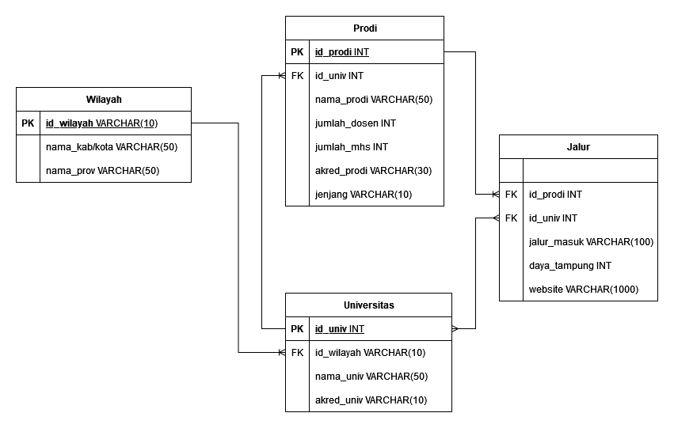

<p align="center">
  
</p>

<div align="center">

# Database Portal StatHub Database

[Tentang](#notebook-tentang)
•
[Dashboard Database](#desktop_computer-dashboard-database)
•
[Demo](#octocat-demo)

</div>

## :bookmark_tabs: Menu

- [Tentang](#notebook-tentang)
- [Dashboard Database](#desktop_computer-dashboard-database)
- [Demo](#octocat-demo)
- [Requirements](#exclamation-requirements)
- [Skema Database](#film_strip-skema-database)
- [ERD](#chart_with_downwards_trend-erd)
- [Deskripsi Data](#postbox-deskripsi-data)
- [Struktur Folder](#open_file_folder-struktur-folder)
- [Tim Pengembang](#ninja-tim-pengembang)


## :notebook: Tentang
<div align="justify">
Ingin mempelajari ilmu yang sangat relevan di era data ini? Jurusan Statistika adalah pilihan tepat bagi kamu! Kamu akan belajar bagaimana mengumpulkan, mengorganisir, menganalisis, dan menafsirkan data. Bagi mereka yang tertarik dengan matematika, sains, dan pemecahan masalah, jurusan ini akan memberikan bekal yang sangat berharga.   
** **

**Apa Itu Statistika?**

Statistika adalah studi tentang pengumpulan, analisis, interpretasi, dan presentasi data. Di era di mana data adalah kunci untuk membuat keputusan bisnis, penelitian ilmiah, dan kebijakan publik, kemampuan untuk memahami dan mengelola data sangat penting. Statistik menawarkan alat dan teknik yang kuat untuk mengatasi kompleksitas dalam data, memberikan kemampuan untuk mengambil keputusan yang berbasis bukti dan mendukungnya dengan argumen yang kuat.

**Apa Saja yang Dipelajari dalam Statistika?**

**Dasar Matematika**: Mulai dari aljabar linear hingga kalkulus, dasar matematika adalah fondasi dari pemahaman statistik yang kuat.

**Statistika Deskriptif**: Belajar untuk merangkum dan mengorganisir data agar bisa dimengerti oleh orang lain.

**Statistika Inferensial**: Mengambil kesimpulan berdasarkan sampel data untuk menggeneralisasikan atau menyimpulkan tentang populasi yang lebih besar.

**Analisis Regresi**: Menjelajahi hubungan antara variabel dengan menggunakan model matematika.

**Statistika Nonparametrik**: Alat yang kuat ketika kita tidak memiliki informasi tentang distribusi populasi.

**Probabilitas**: Merumuskan dan memahami peluang kejadian.

**Pemrograman Statistik**: Penggunaan alat statistik dan bahasa pemrograman statistik seperti R atau Python untuk mengelola dan menganalisis data.

**Pengujian Hipotesis**: Menyelidiki kebenaran klaim atau hipotesis tentang data.

**Kombinatorik**: Belajar menghitung jumlah cara yang berbeda untuk membangun suatu objek atau rangkaian kejadian.

**Teori Pengambilan Keputusan**: Belajar untuk memilih pilihan terbaik berdasarkan informasi yang tersedia.

**Analisis Variansi**: Menggunakan statistik untuk menentukan pengaruh variabel-variabel tertentu terhadap hasil.

**Metode Penelitian**: Belajar untuk mendesain, melaksanakan, dan menafsirkan hasil penelitian.

Kami yakin dengan kurikulum yang komprehensif dan kualitas pengajaran yang terkenal, jurusan Statistika akan memberikan landasan yang kokoh bagi karier di bidang data, penelitian, keuangan, perencanaan bisnis, pengembangan produk, kebijakan publik, dan banyak lagi. Tertarik? Segera mendaftar dan bergabunglah di jurusan Statistika!


### 📑INFO
**Stathub** adalah portal info jurusan statistika perguruan tinggi negeri terlengkap di Indonesia. Seperti yang kita ketahui bersama, perguruan tinggi memiliki banyak jenis, mulai dari Universitas, Institut, Sekolah Tinggi. Banyaknya jenis perguruan tinggi ini memberikan banyak pilihan bagi siswa untuk melanjutkan pendidikan ke jenjang Sarjana(S1). Selain itu terdapat info jenjang bagi freshgraduate untuk melanjutkan ke jenjang Master(S2) dan Doktor(S3).

**StatHub** hadir untuk membantu kamu untuk menemukan pilihan kampus yang terbaik. Tersedia 30 info jurusan statistika di beberapa perguruan tinggi yang tersebar di 34 provinsi dari seluruh Indonesia mulai dari Aceh hingga Papua. Kamu bisa lakukan dengan mudah dengan fitur lokasi kampus.


## :desktop_computer: Dashboard Database

Berikut merupakan tampilan awal dari Portal StatHub Database
<p align="center">
  
</p>

## :octocat: Demo

Berikut merupakan link untuk shinnyapps atau dashboard dari project kami:
https://akmarinak98.shinyapps.io/database_publikasi_statistika/

## :film_strip: Skema Database

Menggambarkan struktur primary key Wilayah, Universitas, Program Studi dan jalur dengan masing-masing foreign key dalam membangun relasi antara tabel atau entitas.

Berikut merupakan Skema Database dari Portal StatHub Database

<p align="center">
  
</p>

## :exclamation: Requirements

- RDBMS yang digunakan adalah PostgreSQL dan ElephantSQL
- Dashboard menggunakan `shinny`, `shinnythemes`, `bs4Dash`, `DT`, dan `dplyr` dari package R

## :chart_with_downwards_trend: ERD

ERD (Entity Relationship Diagram) menampilkan hubungan antara entitas dengan atribut. Pada project ini, entitas wilayah terdapat atribut yang berhubungan dengan atribut universitas yaitu id_univ.

Selanjutnya, entitas universitas berhubungan dengan dua atribut pada entitas lain yaitu id_prodi berhubungan dengan entitas prodi, dan jalur.

Selain itu, entitas prodi saling berhubungan dengan jalur.

<p align="center">
  
</p>

## :postbox: Deskripsi Data
StatHub adalah sebuah portal database universitas-universitas negeri di Indonesia yang memiliki jurusan statistika. Dengan hal ini, data yang diambil yakni berdasarkan pddikti dan sumber web resmi masing-masing universitas. Data yang kami ambil meliputi Universitas, Wilayah Universitas, Data Prodi (Dosen, Mahasiswa), Jenjang Pendidikan yang ada di Universitas tersebut untuk jurusan Statistika.

Berisi tentang tabel-tabel yang digunakan berikut dengan sintaks SQL DDL (CREATE).

### Create Database
Database STATHub menyimpan informasi yang mewakili atribut data yang saling berhubungan untuk kemudian dianalisis.
```sql
CREATE DATABASE portal_StatHub 
    WITH
    OWNER = postgres
    ENCODING = 'UTF8'
    CONNECTION LIMIT = -1
    IS_TEMPLATE = False;
```
### Create Table Wilayah
Table wilayah memberikan informasi kepada user mengenai posisi wilayah universitas, sehingga user dapat mengetahui id wilayah, nama kab/kota, nama provinsi universitas tersebut berada. Berikut deskripsi untuk setiap tabel instansi.
| Attribute         | Type                  | Description                    |
|:------------------|:----------------------|:-------------------------------|
| id_wilayah        | character varying(10) | Id Wilayah                     |
| nama_kabkota      | character varying(50) | Nama Kab/Kota                  |
| nama_prov         | character varying(50) | Nama Provinsi                  |

dengan script SQL sebagai berikut:
```sql
CREATE TABLE IF NOT EXISTS wilayah (
    id_wilayah CHAR(10) PRIMARY KEY,
    nama_kabkota VARCHAR(50) NOT NULL,
    nama_prov VARCHAR(50) NOT NULL
);

select * from wilayah
```
### Create Table Universitas
Table Universitas memberikan informasi yang memudahkan user mengetahui Universitas yang memiliki Jurusan Statistika di dalamnya melalui id Universitas, id wilayah, nama universitas, dan akreditasi universitas terkait. Berikut deskripsi untuk setiap tabel Universitas.
| Attribute          | Type                  | Description                     |
|:-------------------|:----------------------|:--------------------------------|
| id_univ            | integer               | Id Universitas                  |
| id_wilayah         | character varying(10) | Id Wilayah                      |
| nama_univ          | character varying(50) | Nama Universitas                |
| akred_univ         | character varying(10) | Akreditasi Universitas          |

dengan script SQL sebagai berikut:
```sql
CREATE TABLE IF NOT EXISTS universitas (
    id_univ int PRIMARY KEY,
    id_wilayah CHAR(10) NOT NULL,
    nama_univ VARCHAR(50) NOT NULL,
    akred_univ VARCHAR(10) NOT NULL,
    FOREIGN KEY (id_wilayah) REFERENCES wilayah(id_wilayah)
);
select * from universitas
```
### Create Table Prodi
Table prodi memberikan informasi kepada user mengenai beberapa informasi mengenai program studi di universitas tersebut. User dapat mengetahui id prodi dari universitas, id univ, nama program studi,jumlah dosen, jumlah mahasiswa, akreditasi program studi tersebut dan jenjang. Berikut deskripsi untuk setiap tabel penulis.

| Attribute                  | Type                  | Description                     		 |
|:---------------------------|:----------------------|:------------------------------------------|
| id_prodi                   | integer		     | id prodi                       		 |
| id_univ                    | integer		     | id universitas                   	 |
| nama_prodi                 | character varying(50) | nama program studi                     	 |	
| jumlah_dosen               | integer		     | jumlah dosen                 	         |
| jumlah_mahasiswa           | integer	             | jumlah mahasiswa                 	 |
| akred_prodi    	     | character varying(30) | akreditasi prodi                          |
| jenjang		     | character varying(10) | jenjang pendidikan                        |

dengan script SQL sebagai berikut:
sql
CREATE TABLE IF NOT EXISTS prodi (
    id_prodi int PRIMARY KEY,
    id_univ int NOT NULL,
    nama_prodi VARCHAR(50) NOT NULL,
    jumlah_dosen int NOT NULL,
    jumlah_mahasiswa int NOT NULL,
    akred_prodi VARCHAR(30) NOT NULL,
    jenjang VARCHAR(10) NOT NULL,
    FOREIGN KEY (id_univ) REFERENCES universitas (id_univ)
);

### Create Table Jalur
Table Jalur menyajikan informasi lengkap mengenai jalur masuk calon mahasiswa yang akan mendaftar ke universitas yang diinginkan. Selain dapat mengetahui jalur, user juga akan mendapatkan informasi daya tampung dan website tempat mendaftar universitas. Informasi spesifik mengenai id prodi, id universitas, jalur masuk, daya tampung, dan website dapat diketahui melalui table ini.  Berikut deskripsi untuk setiap tabel Jalur.
| Attribute                  | Type                   | Description                     	  |
|:---------------------------|:-----------------------|:------------------------------------------|
| id_prodi                   | integer                | Id Prodi                       		  |
| id_univ                    | integer                | Id Universitas                            |
| jalur_masuk                | character varying(100) | Jalur Masuk                    		  |	
| daya_tampung               | integer                | Daya Tampung                      	  |
| website                    | character varying(1000)| Website                                   |

dengan script SQL sebagai berikut:              
```sql
CREATE TABLE IF NOT EXISTS jalur (
    id_prodi int NULL,
    id_univ int NOT NULL,
    jalur_masuk VARCHAR(100) NOT NULL,
    daya_tampung int NOT NULL,
    website VARCHAR(1000) NOT NULL,
	FOREIGN KEY (id_prodi) REFERENCES prodi (id_prodi),
	FOREIGN KEY (id_univ) REFERENCES universitas (id_univ),
);
```

## :open_file_folder: Struktur Folder

```
.
├── app           # ShinyApps
│   ├── css
│   │   ├── **/*.css
│   ├── server.R
│   └── ui.R
├── data 
│   ├── csv
│   │   ├── **/*.css
│   └── sql
|       └── db.sql
├── src           # Project source code
├── doc           # Doc for the project
├── .gitignore
├── LICENSE
└── README.md
```


## :ninja: Tim Pengembang
+ 💃Database Manager : [Windy Ayu Pratiwi](https://github.com/windyayupratiwi) (G1501231029)
+ 🧜‍♂️Frontend Developer : [Rizky Ardhani](https://github.com/rizkyardhani) (G1501231074)
+ 👩‍🍳Backend Developer : [Devi Permata Sari](https://github.com/dvprmta) (G1501231026)
+ 🏄‍♀️Technical Writer : [Tukhfatur Rizmah A.](https://github.com/tukhfaturr) (G1501231023)
